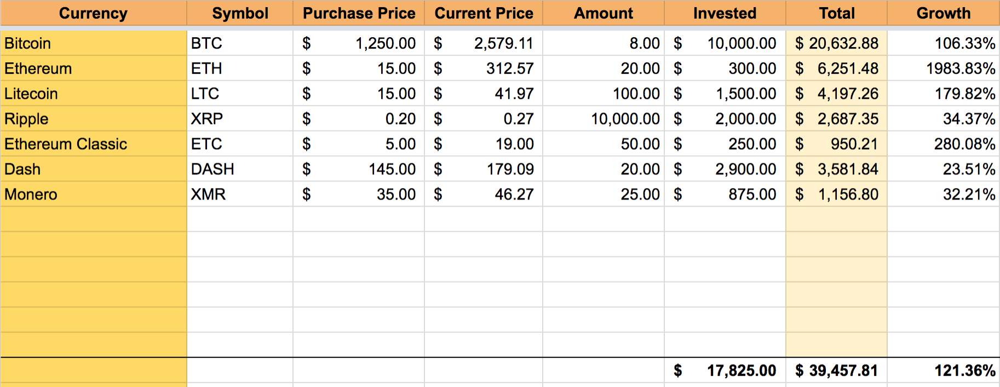

# Cryptocurrency Spreadsheet Utils

Useful cryptocurrency tools (like getting the current price, of Bitcoin, Ethereum) for Google Spreadsheets.

This is the utility script used in the Cryptocurrency Financial Spreadsheet:

https://docs.google.com/spreadsheets/d/1lnE260-F7TSs6onegSVYgRAP0ZZeuUy2YsfO2Ww_eJY/edit?usp=sharing

The easiest way to use it is to make a copy of the spreadsheet above.

## Using

Add script in Tools > Script editor. Then to use, simply add =getCoinPrice("SYMBOL") in a row. For example, Bitcoin would be
    
    =getCoinPrice("BTC")
    
Ethereum would be

    =getCoinPrice("ETH")
    
Litecoin would be

    =getCoinPrice("LTC")       
 
Almost every crypto currency should work because data is fetched from coinmarketcap.com API,
which has many and updates pretty regularly. Data is cached for 25 minutes.
    
Requires Google Sheets permission because we're requesting an external service.
A version without this permission exists here, but doesn't cache and is much slower:
    https://docs.google.com/spreadsheets/d/170ps_Xpo3fVsVi8niV8rSLJnZ5GFsV7GCEx6IpHNvtA/edit?usp=sharing
    
You should use this version if you can as it's much friendlier to coinmarketcap.com's API.

Questions or comments email contact@bradjasper.com or @bradjasper

Happy trading—be safe out there!

